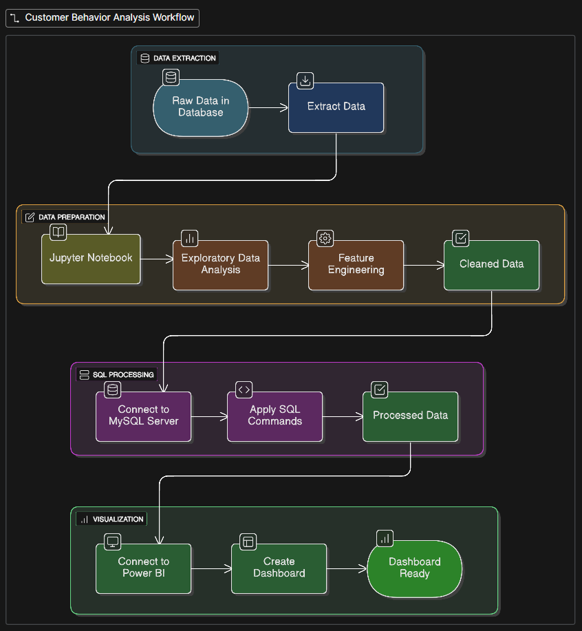

# Customer Behaviour Analysis Dashboard (MySQL + Power BI)

## Project Overview
This project focuses on analysing customer behaviour data to uncover insights into spending patterns, discounts, product preferences, and subscription trends.  
The process involved cleaning and preparing the dataset in Jupyter Notebook, storing the cleaned data in MySQL, performing business analysis through SQL queries, and finally visualising the results through an interactive Power BI dashboard

---

## Objectives
- Clean and preprocess raw customer transaction data for analysis.  
- Store and manage the cleaned dataset in a relational database (MySQL).  
- Answer key business questions using SQL queries (e.g., revenue by gender, top products, subscription impact, etc.).  
- Build a Power BI dashboard for visualising customer spending patterns and business KPIs.

---

## Workflow Summary

---

## Future Improvements
- Add real-time data updates between MySQL and Power BI.
- Integrate predictive analytics (Python/ML) for future sales forecasting.
- Automate report refresh in Power BI Service.
